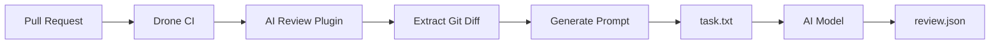

# Drone AI Review Plugin

A Drone CI plugin that generates AI-powered code review prompts from pull request diffs. This plugin creates a structured prompt file that can be used with AI models to perform automated code reviews.

## Features

- 🔍 Extracts git diffs with line number information
- ⚙️ Configurable review types (bugs, performance, scalability, code smells)
- 📝 Generates structured prompts for AI code review
- 🎯 Supports custom review rules via configuration files
- 🔧 Fully customizable through environment variables
- 🐳 Docker-based for easy integration with Drone CI

## How It Works



The plugin:
1. Reads PR information from Drone environment variables
2. Generates a git diff command with line number parsing
3. Creates a comprehensive prompt with review guidelines
4. Outputs a `task.txt` file that can be consumed by AI models

## Installation

### Pre-built Images

Multi-architecture Docker images are available on Docker Hub:

```bash
docker pull abhinavharness/drone-ai-review:latest
```

Supported architectures:
- `linux/amd64` (x86_64)
- `linux/arm64` (ARM 64-bit)

### Building the Docker Image

```bash
docker build -t drone-ai-review:latest .
```

### Building Multi-Architecture Images

The plugin supports multiple architectures: `linux/amd64` and `linux/arm64`.

```bash
# Create a buildx builder
docker buildx create --name multiarch-builder --use

# Build for multiple architectures
docker buildx build --platform linux/amd64,linux/arm64 \
  -t abhinavharness/drone-ai-review:latest \
  --push .
```

## Usage

### Basic Example

```yaml
kind: pipeline
type: docker
name: code-review

steps:
  - name: generate-review-prompt
    image: abhinavharness/drone-ai-review:latest
    settings:
      enable_bugs: true
      enable_performance: true
      enable_scalability: true
      enable_code_smell: true
      comment_count: 10
```

### Advanced Example with Custom Settings

```yaml
kind: pipeline
type: docker
name: code-review-advanced

steps:
  - name: generate-review-prompt
    image: abhinavharness/drone-ai-review:latest
    settings:
      # Enable/disable specific review types
      enable_bugs: true
      enable_performance: true
      enable_scalability: false
      enable_code_smell: true
      
      # Limit number of comments
      comment_count: 20
      
      # Custom output file paths
      output_file: /drone/src/prompts/task.txt
      review_output_file: /drone/src/reviews/review.json
      
      # Custom rules file path
      custom_rules_path: .harness/rules/review.md

trigger:
  event:
    - pull_request
```

## Configuration Parameters

All parameters can be configured through the `settings` block in your `.drone.yml` file.

| Parameter | Environment Variable | Type | Default | Description |
|-----------|---------------------|------|---------|-------------|
| `repo_name` | `PLUGIN_REPO_NAME` or `DRONE_REPO_NAME` | string | auto-detected | Repository name |
| `source_branch` | `PLUGIN_SOURCE_BRANCH` or `DRONE_SOURCE_BRANCH` | string | auto-detected | Source branch of the PR |
| `target_branch` | `PLUGIN_TARGET_BRANCH` or `DRONE_TARGET_BRANCH` | string | auto-detected | Target branch of the PR |
| `merge_base_sha` | `PLUGIN_MERGE_BASE_SHA` or `DRONE_COMMIT_BEFORE` | string | auto-detected | Merge base SHA |
| `source_sha` | `PLUGIN_SOURCE_SHA` or `DRONE_COMMIT_SHA` | string | auto-detected | Source commit SHA |
| `enable_bugs` | `PLUGIN_ENABLE_BUGS` | boolean | `true` | Enable bug detection |
| `enable_performance` | `PLUGIN_ENABLE_PERFORMANCE` | boolean | `true` | Enable performance reviews |
| `enable_scalability` | `PLUGIN_ENABLE_SCALABILITY` | boolean | `true` | Enable scalability reviews |
| `enable_code_smell` | `PLUGIN_ENABLE_CODE_SMELL` | boolean | `true` | Enable code smell detection |
| `comment_count` | `PLUGIN_COMMENT_COUNT` | integer | `10` | Maximum comments per PR |
| `output_file` | `PLUGIN_OUTPUT_FILE` | string | `../output/task.txt` | Path where prompt file is written |
| `review_output_file` | `PLUGIN_REVIEW_OUTPUT_FILE` | string | `../output/review.json` | Path where AI should write review output |
| `custom_rules_path` | `PLUGIN_CUSTOM_RULES_PATH` | string | `.harness/rules/review.md` | Custom rules file path |

## Review Types

### 🐛 Bug Detection (`enable_bugs`)
Looks for critical bugs such as:
- Null pointer exceptions
- Division by zero
- Logical errors
- Incorrect error handling

### ⚡ Performance Issues (`enable_performance`)
Identifies performance concerns like:
- Nested loops
- Inefficient algorithms
- Unnecessary computations
- Poor data structure choices

### 📈 Scalability Concerns (`enable_scalability`)
Detects scalability issues such as:
- Memory overflow risks
- Large string operations
- Resource leaks
- Unbounded data growth

### 🔍 Code Smells (`enable_code_smell`)
Finds code quality issues including:
- Duplicate code
- Long methods
- Complex conditionals
- Poor naming conventions

## Custom Review Rules

You can provide custom review rules by creating a file at `.harness/rules/review.md` (or any path specified in `custom_rules_path`). The plugin will include these rules in the generated prompt.

Example `.harness/rules/review.md`:

```markdown
# Custom Review Rules

## Project-Specific Guidelines
- All database queries must use prepared statements
- Error messages must not expose sensitive information
- All public APIs must have rate limiting

## Security Requirements
- Never log sensitive user data
- All user inputs must be validated
- Use constant-time comparison for secrets
```

## Output Files

The plugin works with two files:

### 1. Prompt File (`output_file`)
Default: `../output/task.txt`

A comprehensive prompt file containing:
- Repository and PR information
- Git diff command with line number parsing
- Review guidelines based on enabled types
- JSON output format specification
- Instructions for AI model

### 2. Review Output File (`review_output_file`)
Default: `../output/review.json`

The path where the AI model should write the review output. The generated prompt instructs the AI to create this file with the following structure:

```json
{
  "reviews": [
    {
      "file_path": "path/to/file.go",
      "line_number_start": 42,
      "line_number_end": 45,
      "type": "bug|performance|scalability|code_smell",
      "review": "Description of the issue and suggested fix"
    }
  ]
}
```

## Development

### Prerequisites
- Go 1.21 or higher
- Docker (with buildx for multi-arch builds)
- Git

### Local Development

1. Clone the repository:
```bash
git clone https://github.com/abhinav-harness/ai-review-prompt-plugin.git
cd ai-review-prompt-plugin
```

2. Install dependencies:
```bash
go mod download
```

3. Build the plugin:
```bash
make build
# or
go build -o drone-ai-review .
```

4. Run tests:
```bash
make test
# or
go test -v ./plugin/
```

5. Run locally:
```bash
export PLUGIN_REPO_NAME="my-repo"
export PLUGIN_SOURCE_BRANCH="feature-branch"
export PLUGIN_TARGET_BRANCH="main"
export PLUGIN_MERGE_BASE_SHA="abc123"
export PLUGIN_SOURCE_SHA="def456"
export PLUGIN_OUTPUT_FILE="./output/task.txt"
export PLUGIN_REVIEW_OUTPUT_FILE="./output/review.json"
./drone-ai-review
```

### Using Make

```bash
# Build the binary
make build

# Run tests
make test

# Run tests with coverage
make test-coverage

# Build Docker image
make docker-build

# Build and push multi-arch image
make docker-multiarch
```

## Integration with AI Models

The generated prompt file can be used with various AI models:

### OpenAI GPT-4
```bash
cat output/task.txt | openai-cli --model gpt-4
```

### Anthropic Claude
```bash
cat output/task.txt | claude-cli
```

### Local Models (Ollama, etc.)
```bash
cat output/task.txt | ollama run codellama
```

## Troubleshooting

### No output file generated
- Check that the output directory has write permissions
- Verify that git repository is properly cloned in Drone workspace

### Missing SHA values
- Ensure the plugin runs in a pull request context
- Check that Drone environment variables are properly set

### Git diff command fails
- Verify git is installed in the container
- Ensure the repository has proper git history

## Contributing

Contributions are welcome! Please feel free to submit a Pull Request.

1. Fork the repository
2. Create your feature branch (`git checkout -b feature/amazing-feature`)
3. Commit your changes (`git commit -m 'Add amazing feature'`)
4. Push to the branch (`git push origin feature/amazing-feature`)
5. Open a Pull Request

## License

MIT License - see LICENSE file for details

## Documentation

- **[README.md](README.md)** - This file, main documentation
- **[USAGE.md](USAGE.md)** - Detailed usage examples and integration guides
- **[SETUP.md](SETUP.md)** - Setup and deployment guide
- **[TESTING.md](TESTING.md)** - Testing guide
- **[CONTRIBUTING.md](CONTRIBUTING.md)** - Contribution guidelines
- **[CHANGELOG.md](CHANGELOG.md)** - Version history

## Support

For issues, questions, or contributions, please visit:
- GitHub Issues: https://github.com/abhinav-harness/ai-review-prompt-plugin/issues
- Docker Hub: https://hub.docker.com/r/abhinavharness/drone-ai-review

## Acknowledgments

- Built for Drone CI
- Inspired by automated code review tools
- Powered by AI/ML models
